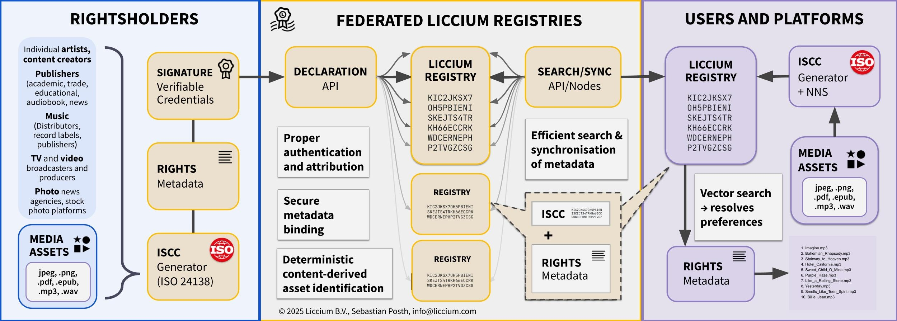

# What is Liccium?

Liccium is software for digital content authentication and rights management, designed for individual creators (Liccium Cloud Application) and media organisations. It enables users to digitally sign and declare ownership, rights, and metadata for their content while ensuring that these claims remain verifiable—even if metadata is removed, the file is modified, or the content is shared beyond the creator’s or rightsholder’s control.

Instead of embedding metadata, Liccium uses soft binding, linking content to signed declarations stored in federated registries. These registries ensure that ownership claims, rights statements, and licensing information remain discoverable, accessible, and independently verifiable – without relying on a single centralized database or proprietary system.

<figure><figcaption>
Liccium Overview
</figcaption></figure>
