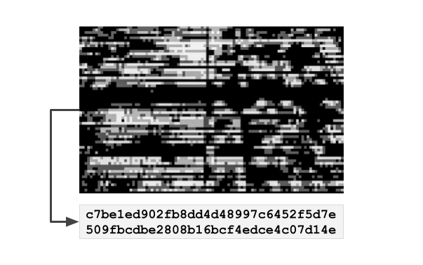

# Content timestamping

<figure><figcaption></figcaption></figure>

_Cryptographic hashes are secured on servers or on-chain_

Another approach to potentially tamper-proof authenticity and integrity of digital media is to timestamp the content by hashing the media asset and storing the resulting cryptographic hash on an immutable ledger or in any other trusted storage.

However, despite assertions to the contrary, timestamping cryptographic hashes on public blockchains neither provides information about ownership or attribution, nor does it express a copyright or the possession of any right to the content. It also does not “protect” the copyright of rightsholders. Timestamping only proves access to a hash by the declaring party, which proves the existence of this hash, and subsequently, the existence of the media asset, at a given point in time.

Managing and linking the hash is a difficult task in itself. Cryptographic hashes work securely and reliably in technical environments and systems that are in control of the user or application offering the service. However, they are too sensitive and fragile to be used as a reliable form of content identification or recognition in online media environments with highly incentivized adversaries that can easily manipulate content. The same applies to online platforms that compress, convert, modify or strip metadata from the media files.

Most timestamping services pursue a centralised approach to replicate the identical environment for creation and verification of the cryptographic hash, and thereby ensuring a replication of conditions with no single pixel or character of the asset being changed.
