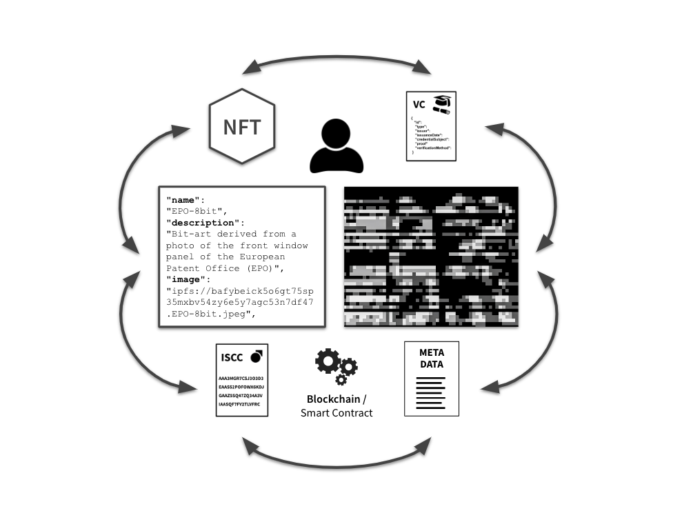

# Making a difference

For the last 15 years, Posth Werk BV has been a main contributor in developing new standards, protocols and products that significantly impact and revolutionise the digital media markets of the future.

The Liccium app is implementing and improving novel and highly innovative technology, creating an application of a new kind that helps content creators and rightsholders to tackle the current challenges of digital media and trust.

* Instead of timestamping and signing cryptographic hashes, users can declare ISCC codes. With a combination of cryptographic and similarity-preserving hashes, ISCC supports decentralised content identification and matching of same and similar, near-duplicate content, even if the content has been altered or manipulated or embedded metadata have been stripped from the file;
* Instead of embedding digital signatures and claims into the digital media files, users can digitally sign a declaration transaction by means of a wallet software under their own control;
* Instead of embedding metadata into the file itself or including watermarks and other information to the perceptual content, we suggest inseparably connecting external metadata to the content together with the declaration of ISCC codes;
* Instead of relying on centralised services to verify content integrity or claims to content and metadata, users can rely on decentralised trust, generate the ISCC and reverse-lookup all data associated with the ISCC declaration.

<figure><figcaption></figcaption></figure>
