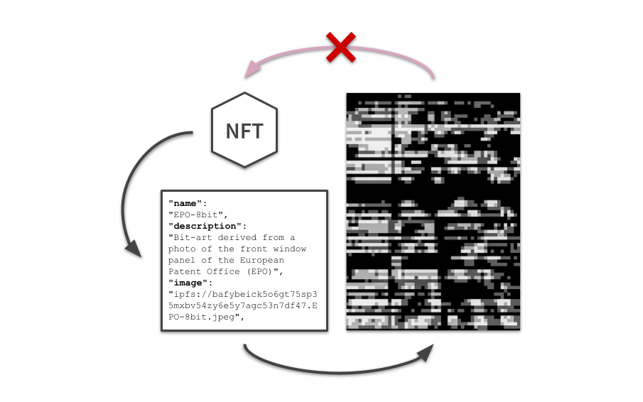

# NFTs

<figure><figcaption></figcaption></figure>

_Non-fungible tokens on public networks can serve as a pointer to creative works._

NFTs, or non-fungible tokens, are being promoted as a solution for creators and rightsholders to maintain control of copyrights and ensure fair remuneration for their creative work. They have become increasingly popular as the tokens allow for the transfer of value on decentralised networks and have become comparably easy to mint.

Common misunderstandings have limited the adoption of NFTs for digital content licensing, especially as there have been reported cases of token scams, fraud, and abuse of copyrights that negatively affected the reputation and undermined the trust in the NFT markets, in general.

Currently, the use of NFTs suffers from a lack of legal awareness and knowledge. NFTs do not provide information about ownership or attribution and do not represent a copyright claim. Rights and licences are often not even linked in the declaration metadata of the NFTs.

Learning about the terms of use of a related creative work requires manual effort and expert knowledge from users to be able to locate the smart contract and token ID of the NFT to potentially receive further information about the creative work.
