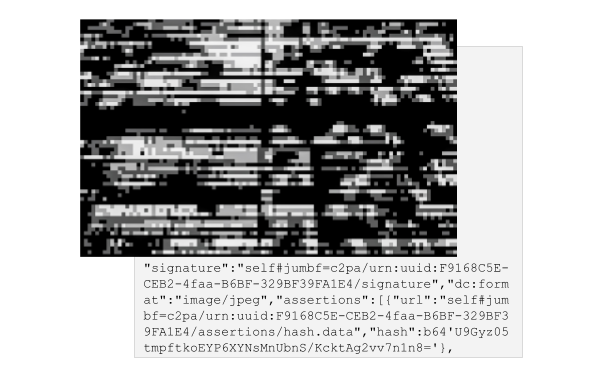

# Signature embedding

<figure><figcaption>
Signature embedding
</figcaption></figure>

_Digital certificates and verifiable claims are embedded into the asset metadata – c2pa.org_

The Coalition for Content Provenance and Authenticity (C2PA) is a consortium of members from the Content Authenticity Initiative (CAI) and Project Origin. C2PA is developing technical specifications for establishing content provenance and authenticity. They are refining a proposed international technical standard that uses capture devices within a trusted execution environment and certified software applications to certify the source and provenance of media content.

Content creators and publishers can use apps that support this standard to create and embed cryptographically verifiable metadata containing information about the asset's creation and edit actions, copyright, licences, capture device details, and software used. The assertions are designed to be hashed and gathered into a verifiable claim that is digitally signed, ensuring the integrity of the claim.

However, this method does not yet allow for the validation of the integrity of the digital media asset in cases where the metadata has been removed or tampered with, which is a common issue in online content sharing and social media platforms that strip away embedded metadata for security and business reasons.
