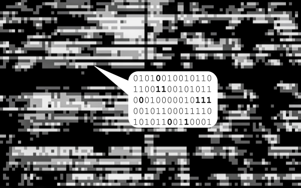

# Watermarking and steganography

<figure><figcaption>
Watermarking and steganography
</figcaption></figure>

_In/visible messages are embedded in the non/perceptible parts of the media file_

Efficiently incorporating information into media files can be achieved through techniques like watermarking and steganography, where digital signatures, certificates, or other data can be embedded either visibly or covertly. These well-established technologies, with centuries of history, offer a dependable means to safeguard both the file and its embedded metadata against tampering.

In the context of discussions surrounding synthetic or AI-generated content, watermarking and steganographic methods have emerged as potential solutions to address the challenge of identifying AI-generated content and enhancing transparency in media markets.&#x20;

However, there are drawbacks to consider. These techniques often rely on proprietary and costly technology, creating dependencies, and necessitating that users have access to the same software used for embedding hidden messages initially. Moreover, the embedded data can be susceptible to removal.
