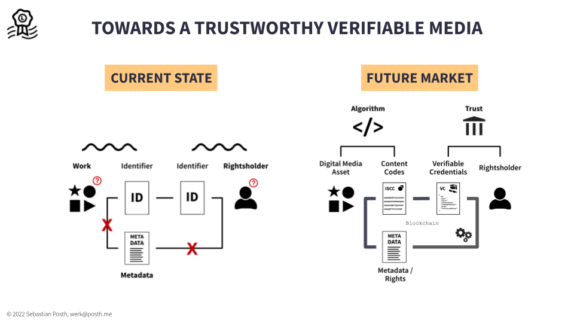
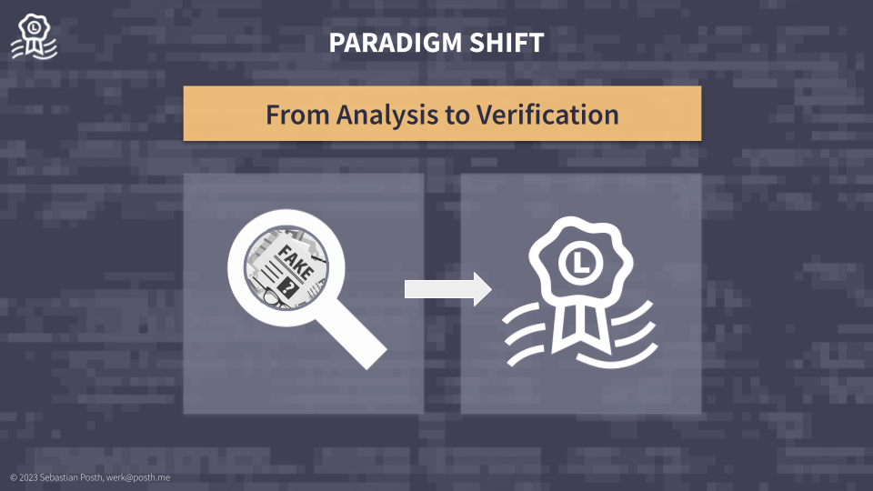

# The new paradigm

<figure><figcaption>
Towards a trustworthy verifiable media environment
</figcaption></figure>

The digital media landscape faces numerous challenges that must be addressed to create a safe and trustworthy environment for creators, users, and stakeholders, such as:

* The lack of proper identification of digital works;
* Uncertainty about the original content creator or rightsholder;
* Missing metadata and rights management information.

These problems are exacerbated by the vast amount of creator, AI and user generated media assets that are being published and shared on the Internet, social media, and retail platforms on a daily basis.

A manual analysis for verification purposes is laborious, time-consuming, inefficient, and ineffective, making it unlikely to be undertaken by consumers or platforms themselves. Relying solely on manual analysis to combat issues like fake news, misappropriation, or unauthorised use of digital media content is not a promising approach. With the advent of new AI software, the problem is expected to worsen.

By providing an effective identification system that allows to inseparably connect metadata, rights management information, and verifiable credentials to the content, we can ensure that creators receive proper credit and compensation for their work, users can trust the content they consume, and stakeholders can operate in a safe and compliant environment.

<figure><figcaption></figcaption></figure>

We propose a paradigm shift in the way digital media files are assessed: moving from analysis to verification.

The new solution automates the cryptographic verification process, eliminating the need for manual searches or technical forensic analysis of millions of digital media assets.&#x20;

Implementing cryptographic methods can:

* Enable content creators and rightsholders to digitally sign content-derived ISCC codes;
* Allows to to inseparably bind rights, license, and other metadata to the content;
* Provide publicly accessible and verifiable credentials;
* Increase trust and transparency in claims and attestations of the declaration.

By using cryptographic methods, content creators and rightsholders can enhance the trustworthiness of their content and the transparency of their claims. Digital media files can be securely and efficiently verified by users and platforms, eliminating the need for time-consuming and ineffective manual analysis.

This approach will prove the integrity and authenticity of media files, enabling users to identify and use media according to the terms provided by the legitimate creators and rightsholders. Fake or manipulated media may be detected easily.
