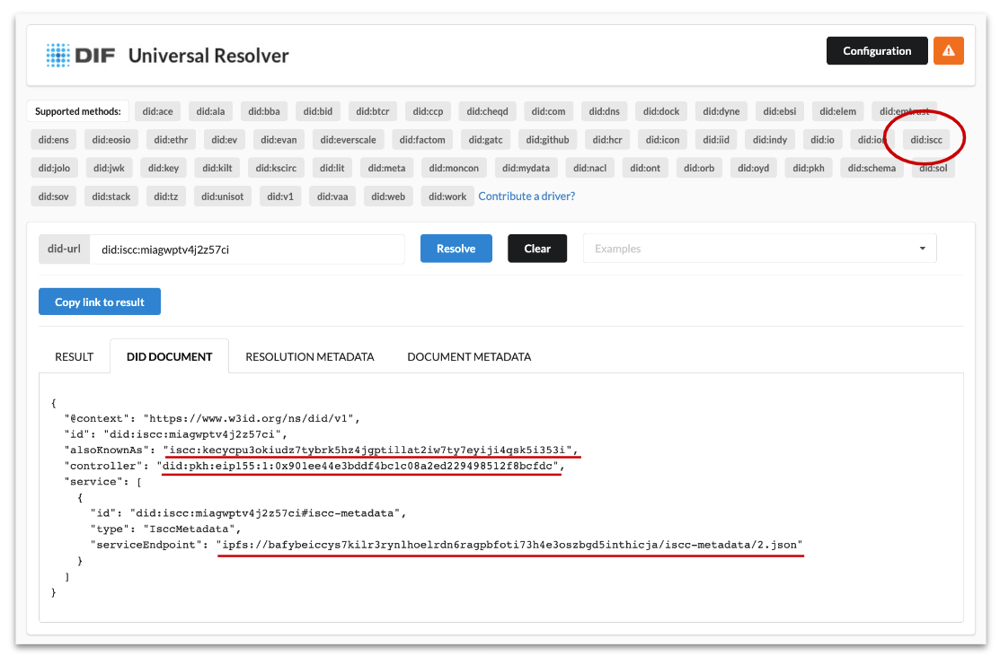

# did:iscc DID method

<figure><figcaption>
Source: <a href="https://dev.uniresolver.io/">https://dev.uniresolver.io/</a>
</figcaption></figure>

To enhance the usability of the ISCC declaration identifier – the ISCC-ID –, ISCC Foundation developed a DID method for the ISCC-ID, the “did:iscc” DID method. This supports interoperability of the ISCC with external systems and standards. did:iscc makes ISCC records machine-readable, portable, and interoperable for systems that aim to disambiguate content and consume data about declaration events on any conformant public blockchain network, present or future.

With the introduction of the did:iscc DID method specification, it is now possible to identify declarations of content-derived identifiers, fingerprints and other metadata. This means that any claim or assertion to digital media content now itself has a decentralised ID that can be resolved by anyone. This way, access to the ISCC code, the creator, rightsholder or user wallet who signed the declaration, and the link to metadata of the declaration is granted.

The W3C recommendation for Decentralized Identifiers (DIDs) v1.0 and Verifiable Credentials Data Model v1.1 provide the standard for the decentralised identification of natural persons, organisations, but also machines and things. The field of digital media content has been neglected by the DID community for too long. Integrating the upcoming ISO standard ISCC with the DID system of the W3C improves ISCC interoperability to a great deal.

The fact that the did:iscc DID method has been approved by the W3C community and listed by the W3C DID Specification Registries is in itself a huge achievement and a great enhancement of the ISCC system.

Furthermore, the Decentralized Identity Foundation (DIF) has incorporated the driver for the DID method in the Universal Resolver. This means that did:iscc can already be resolved via the public Universal Resolver-service of the Decentralized Identifier Foundation (DIF) or other applications.

It can be said that the did:iscc DID method is an important milestone to create trust and transparency for digital media content distributed online.

Now, a W3C-compatible ID exists for content timestamping as well as other declaration events. With the DID resolver, DID documents provide a standardised way to discover metadata and services related to the content and it’s declaring entities – should did:iscc allow access to the ISCC code of the declaration, the wallet of the creator, rights holder, or other user or entity digitally signing the declaration, and the link to metadata of the declaration.
