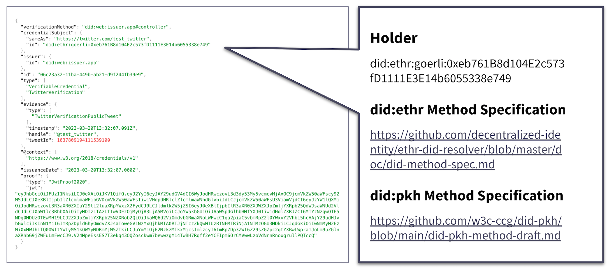

# did:pkh and did:ethr DID methods

<figure><figcaption></figcaption></figure>

To establish the declaring party of the ISCC being the creator or rightsholder and the controller entity of the did:iscc document, the Liccium app uses the did:pkh or did:ethr DID methods:

* did:pkh Method Specification, status: draft, 22 April 2022, [https://github.com/w3c-ccg/did-pkh/blob/main/did-pkh-method-draft.md](https://github.com/w3c-ccg/did-pkh/blob/main/did-pkh-method-draft.md)
* did:ethr Method Specification, status: draft, 7 November 2022,\
  [https://github.com/decentralized-identity/ethr-did-resolver/blob/master/doc/did-method-spec.md](https://github.com/decentralized-identity/ethr-did-resolver/blob/master/doc/did-method-spec.md)

The did:pkh DID method employs a public address from a blockchain addressing system, commonly referred to as a “blockchain address,” that is derived from the public key hash (“pkh”) to serve as the identifier for the DID subject. This address references the wallet address of the declaring party, acting at the same time as declarer and possible updater of the ISCC record, thereby securing control of the did:iscc DID document.

In this method, a DID is represented as a unique string prefixed with “did:pkh:” and a short code (see [https://namespaces.chainagnostic.org/](https://namespaces.chainagnostic.org/)) to represent the blockchain addressing system, followed by the base58-encoded SHA-256 hash of the subject's public key. This identifier can be used to research the DID document, which contains information about the subject, such as public keys, authentication methods, and service endpoints.

While did:pkh is a DID that is supposed to be chain-agnostic, did:ethr DID method allows any Ethereum smart contract or key pair account, or any secp256k1 public key to become a valid identifier.
