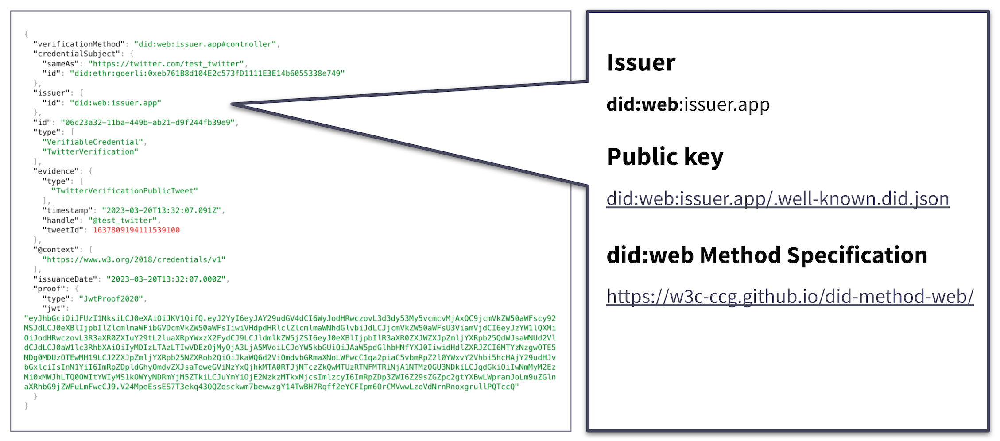

# did:web DID method

<figure><figcaption></figcaption></figure>

The Liccium app uses the did:web method to establish trust in issued credentials. It also uniquely identifies the issuer of a verifiable credential, based on their control of a specific web domain.

The did:web method entails storing a DID document at a web location, which can be accessed by anyone through a secure web protocol such as HTTPS. By hosting the DID document on their domain, the issuer can demonstrate control of it.

The DID document contains information about the DID subject, including public keys, authentication methods, and service endpoints. This includes as an assurance that only the subject controls a secure HTTPS webspace.

The keys contained in the did:web document can facilitate secure communication with the subject and simplify verification of their signatures on VCs.

By using did:web for the issuer, we can make use of this established trust framework infrastructure, leverage the reputation and security of a web domain using browser certificates and thereby establish the reputation and security of a did:web.

It is worth noting that although did:web is not yet an official or established W3C standard, it is unlikely to undergo significant changes that would impact its use in Liccium.


```
DID:WEB METHOD

"Creating a DID [web] is done by:

applying at a domain name registrar for use of a domain name and 
storing the location of a hosting service, the IP address at a DNS lookup service
creating the DID document JSON-LD file including a suitable keypair, e.g., using the Koblitz Curve, and storing the did.json file under the well-known URL to represent the entire domain, or under the specified path if many DIDs will be resolved in this domain.

For example, for the domain name w3c-ccg.github.io, the did.json will be available under the following URL:

did:web:w3c-ccg.github.io
 -> https://w3c-ccg.github.io/.well-known/did.json"
```


Source: did:web Method Specification, 11 January 2023, [https://w3c-ccg.github.io/did-method-web/](https://w3c-ccg.github.io/did-method-web/)
