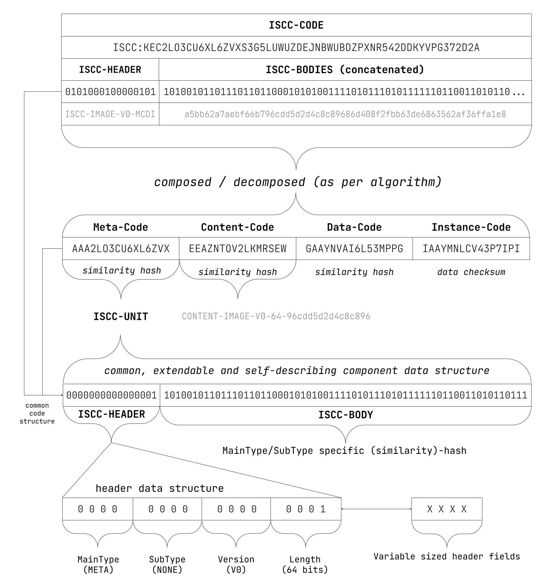
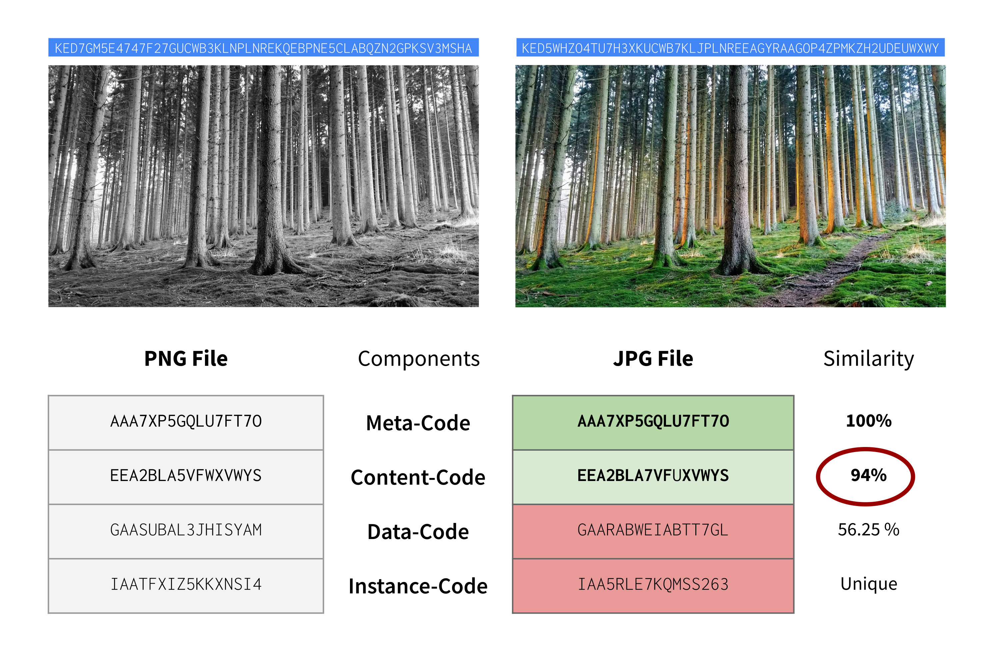

# The International Standard Content Code (ISCC)

<figure><figcaption>
Source: <a href="https://core.iscc.codes/#iscc-architecture">https://core.iscc.codes/#iscc-architecture</a>, by T. Pan
</figcaption></figure>

The Liccium Trust Engine is based on the International Standard Content Code (ISCC), which is a system developed by the ISCC Foundation.

ISCC is an open identification system for the cultural and creative communities that utilises short identifiers to identify and match digital media assets. The codes are generated using a combination of cryptographic and similarity- preserving hashes. They enable decentralisation of content identification, and matching of similar or duplicate content.

The main distinguishing feature of the ISCC to other existing standardised content identifiers (e.g., ISBN, DOI, or ISRC) is the fact that the ISCC is generated from the content file itself. This means that anyone with access to digital content – it could be the original creator, a publisher, an intermediary, an online platform, or a consumer – can decentrally generate the same or similar identifier from the same or similar digital media asset.

This enables anyone to unambiguously identify identical or match with a certain degree of probability similar content independent of centralised authorities, organisations, registries or proprietary third-party services and software.

<figure><figcaption>
Example showing comparison of ISCC codes / units
</figcaption></figure>

Processing the digital media asimasets with the algorithms provided in the ISCC specification creates a unique composite code that consists of (currently) four units: the Meta-Code, Content-Code, Data-Code, and Instance-Code. Thus, the ISCC identifies and describes content across multiple layers: from the embedded or external metadata, the normalised content, the encoded file data down to the bitstream of an individual file.

ISCC can be used to:

* Automatically distinguish different versions of the same content;
* Cluster similar content;
* De-duplicate and to disambiguate content in different content repositories;
* Assign identifiers to granular content chunks;
* Verify data integrity or recognise data manipulation.

The ISCC Foundation, a not-for-profit organisation, maintains the open reference implementation of the ISCC and provides free open-source tools anyone can use to generate ISCC codes.

In 2019, the ISCC was submitted to ISO by the German standards organisation, DIN. After two years of preliminary work, in 2021 the ISCC was approved as a full work item by the participating members of the ISO sub-committee TC 46/SC 9 in 2021.

The ISCC is expected to be registered as a draft international standard (DIS) with the ISO stage code 40.00 in October 2023, the standard is scheduled to be published in early 2024.
