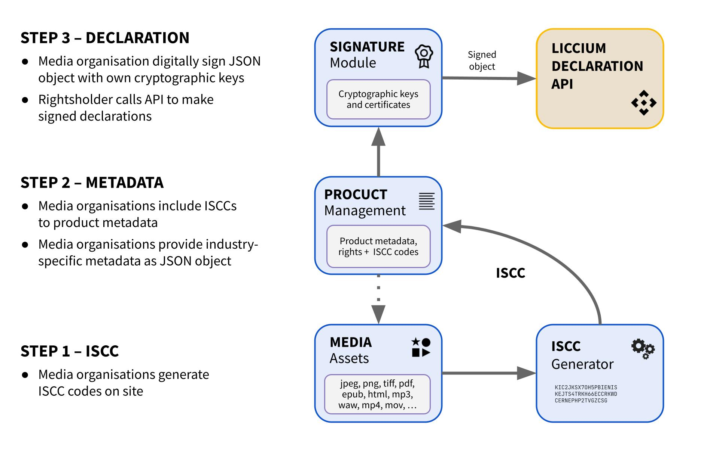

---
layout:
  title:
    visible: true
  description:
    visible: false
  tableOfContents:
    visible: true
  outline:
    visible: true
  pagination:
    visible: true
---

# Liccium B2B Declaration Engine

The Liccium B2B Declaration Engine is an advanced on-premise solution designed for media organisations and rightsholders to efficiently manage large-scale content declarations. It enables seamless integration into existing workflows, allowing for automated rights management, authentication, and metadata updates across vast content repositories.

With high scalability, the engine processes declarations for millions of media assets while providing secure and verifiable registry access for third parties. The API supports industry-specific adaptations, allowing publishers, stock photo platforms, and music labels to define tailored rights management workflows. Seamless integration with Product Management Systems and other business processes ensures efficient handling of metadata, rights declarations, and compliance requirements.

All functionalities, from content registration to rights enforcement, can be fully managed via API, enabling automation and streamlined integration into existing enterprise systems.

The engine supports opt-out declarations for AI training, AI content licensing, and certified originality declarations, helping rightsholders maintain control over their content. It also ensures proper attribution by using certificates and credentials and enables continuous metadata updates, keeping content records accurate for intermediaries, retailers, and platforms.

<figure><figcaption></figcaption></figure>

The **Liccium Declaration Engine** enables media organisations and rightsholders to generate, manage, and publish their content declarations using **ISCC codes** and cryptographic signatures. The process follows three key steps:

**Step 1: ISCC Code Generation**

* Media organisations generate International Standard Content Codes (ISCCs) for their media assets (e.g., images, documents, audio, video).

**Step 2: Metadata & Rights Declaration**

* ISCC codes are added to existing product metadata.
* Industry-specific metadata is structured as a JSON object for content identification and rights management.

**Step 3: Digital Signing & Declaration Submission**

* Media organisations digitally sign the metadata using their cryptographic keys.
* The signed declaration is submitted via the **Liccium Declaration API**, ensuring authenticity and enforceability.
