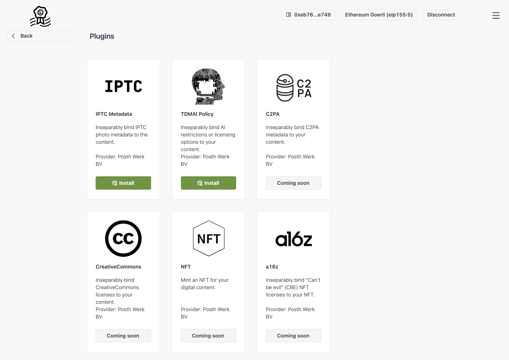
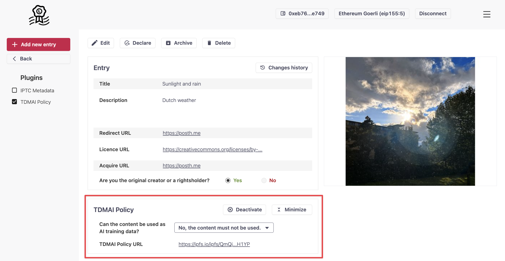

# Liccium plugins

Liccium plugins enable the integration of  use-case- or industry-specific metadata to declarations or other services provided by 3rd parties to the Liccium app. These plugins enhance the app's generic functionality for creators and rightsholders. With Liccium they can seamlessly embed metadata and bind external metadata to their content, thereby customising the app to their specific needs.

<figure><figcaption>
Liccium plugins
</figcaption></figure>

## IPTC photo metadata

Photographers and photojournalists currently use the IPTC standards to attach technical, descriptive, and administrative metadata or copyright information to their images. With Liccium, they can inseparably bind IPTC photo metadata to their content even if the content has been altered or manipulated, or metadata have been stripped from the content.

<figure><figcaption>
Providing IPTC photo metadata
</figcaption></figure>

## TDM·AI policy

With the evolving landscape of AI, there's a pressing need for an application that allows content creators and rightsholders to declare their permissions regarding TDM.&#x20;

The EU's DSM Directive on Copyright provides a default condition for TDM, but there's ambiguity when rightsholders want to opt-out or explicitly give permission. The TDM·AI protocol is motivated by the need to:

1. Provide clarity and ease for rightsholders to declare their TDM permissions.
2. Offer a decentralised, immutable, and verifiable system for these declarations.
3. Ensure that AI providers and other stakeholders can easily understand and respect these declarations.

Liccium offers a protocol to facilitate machine-readable opt-out declarations for Text and Data Mining (TDM) for AI providers based on the DSM Directive on Copyright 2019/790, Article 4, leveraging the benefits of the International Standard Content Code ([ISCC](https://iscc.codes)) and [Creator Credentials](https://docs.creatorcredentials.com/).

<figure><figcaption>
TDM·AI policy
</figcaption></figure>

The declaration binds a machine-readable declaration to the content by the rightsholder limiting commercial TDM usage.

<figure><figcaption>
Machine-readable opt-out declaration (Art. 4 EU DSM Directive)
</figcaption></figure>
