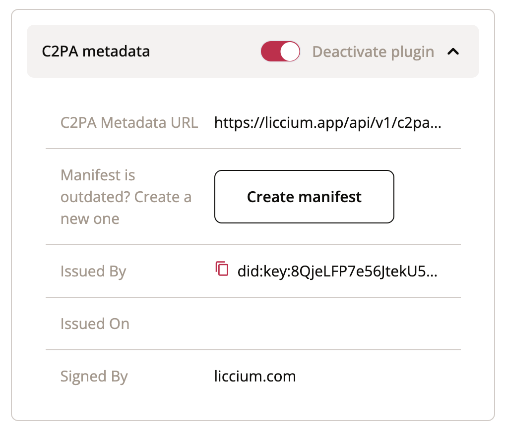

# Liccium plugins

Liccium plugins enable the integration of use-case- or industry-specific metadata to declarations or other services provided by 3rd parties to the Liccium app. These plugins enhance the app's generic functionality for creators and rightsholders. With Liccium they can seamlessly embed metadata and bind external metadata to their content, thereby customising the app to their specific needs.

<figure><figcaption><p>Liccium Plugins</p></figcaption></figure>

## IPTC photo metadata

Photographers and photojournalists currently use the IPTC standards to attach technical, descriptive, and administrative metadata or copyright information to their images. With Liccium, they can inseparably bind IPTC photo metadata to their content even if the content has been altered or manipulated, or metadata have been stripped from the content.

<figure><figcaption></figcaption></figure>

## TDM·AI policy

With the evolving landscape of AI, there's a pressing need for an application that allows content creators and rightsholders to declare their permissions regarding TDM.&#x20;

The EU's DSM Directive on Copyright provides a default condition for TDM, but there's ambiguity when rightsholders want to opt-out or explicitly give permission. The TDM·AI protocol is motivated by the need to:

1. Provide clarity and ease for rightsholders to declare their TDM permissions.
2. Offer a decentralised, immutable, and verifiable system for these declarations.
3. Ensure that AI providers and other stakeholders can easily understand and respect these declarations.

Liccium offers a protocol to facilitate machine-readable opt-out declarations for Text and Data Mining (TDM) for AI providers based on the DSM Directive on Copyright 2019/790, Article 4, leveraging the benefits of the International Standard Content Code ([ISCC](https://iscc.codes)) and [Creator Credentials](https://docs.creatorcredentials.com/).

<figure><figcaption></figcaption></figure>

The declaration binds a machine-readable declaration to the content by the rightsholder limiting commercial TDM usage.


```json
{
"TDMAI": false,
"TDMAI_summary": "Content must not be used for training generative AI.",
"TDMAI_policy": "Automated analysis of the work to extract information from it, especially about patterns, trends, and correlations for the purpose of training models and applications of generative AI, is reserved. Text and Data Mining (TDM) is permitted for general purpose AI systems that do not generate synthetic audio, image, video, or text content and for scientific research purposes or for temporary acts of reproduction as provided for in Article 5(1) of Directive 2001/29/EC."
}
```


For more information, please visit the TDM·AI homepage:  [https://tdmai.org/](https://tdmai.org/)


TDM·AI


## C2PA Metadata

The Coalition for Content Provenance and Authenticity (C2PA) is developing technical specifications for establishing content provenance and authenticity. They are refining a proposed ISO standard (ISO 22144) that uses capture devices within a trusted execution environment and software applications to certify the source and provenance of media content. Content creators and publishers can use apps that are based on this standard to embed cryptographically verifiable metadata containing information about the asset’s creation and edit actions, copyright, licenses, capture device details, and software used. The assertions are designed to be hashed and gathered into a verifiable claim that is digitally signed, ensuring the integrity of the claim.

Using the Liccium app, users can create a C2PA manifest from their metadata and embed the manifest into media asset. The C2PA method stores information directly within the media file. If embedded metadata is removed or inaccessible, the content can’t be checked for authenticity.&#x20;

That’s why Liccium not only includes C2PA metadata inside the file but additionally creates a separate record of the data outside the file. This record is inextricably connected to the content’s unique fingerprint (ISCC), ensuring the data can still be verified even if it’s removed from the file itself.&#x20;

<figure><figcaption></figcaption></figure>

For more information, see section on [Soft-Binding](../../technology/metadata-binding.md).


[metadata-binding.md](../../technology/metadata-binding.md)

