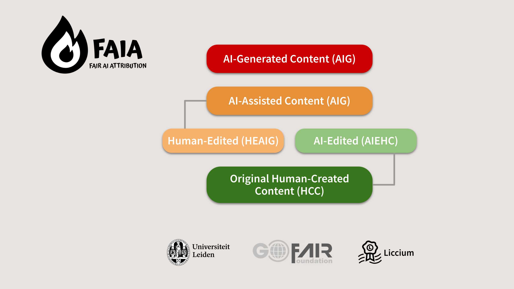

# FAIA – Fair AI Attribution

## Fair AI Attribution (FAIA)

**FAIA** is a structured framework for disclosing the role of artificial intelligence in content creation. FAIA will be developed by **Liccium** in collaboration with **Leiden University** and the **GO FAIR Foundation**, addressing a growing need for transparency in digital publishing and research.

With the increasing integration of generative AI tools – ranging from writing assistants to full content generators – creators, publishers, and academic researchers need a consistent and verifiable way to indicate whether and how AI has contributed to the content. FAIA provides that mechanism.

<figure><figcaption></figcaption></figure>

### Goals and Scope

FAIA enables creators and rightsholders to:

* Disclose **how AI was involved** in the creation or editing of content.
* Align with **regulatory requirements** like the EU AI Act (Art. 50).
* Promote **provenance, reproducibility, and trust** in digital publishing.

The framework is implemented as a **Liccium plugin**, allowing users to flag AI involvement directly within Liccium's declaration and signing interface. These flags are machine-readable, interoperable, and persistently linked to the content.

### Attribution Flags

FAIA introduces a controlled vocabulary for AI contribution, modelled after standards like the **IPTC Digital Source Type**, which can be used for visual content, and aligning with proposals like the **STM Association’s classification system**.&#x20;


Recommendations for a Classification of AI Use in Academic Manuscript Preparation:

[https://stm-assoc.org/document/recommendations-for-a-classification-of-ai-use-in-academic-manuscript-preparation/](https://stm-assoc.org/document/recommendations-for-a-classification-of-ai-use-in-academic-manuscript-preparation/)

Guidance for using the IPTC Digital Source Type:

[https://www.iptc.org/std/photometadata/documentation/userguide/#\_guidance\_for\_using\_digital\_source\_type](https://www.iptc.org/std/photometadata/documentation/userguide/#_guidance_for_using_digital_source_type)


### Implementation in Liccium

Using the FAIA plugin, users can:

* Select AI involvement types during declaration process.
* Potentially provide details, e.g. provide tool versions and usage context (e.g., "ChatGPT-4, used for summarization").
* Bind this information cryptographically to the content's **ISCC code**, ensuring it travels with the media.

All declarations are verifiable, timestamped, and publicly resolvable via Liccium registries.

### Outcomes and Impact

FAIA promotes ethical publishing practices by:

* Helping creators and researchers **avoid misrepresentation**.
* Supporting **disclosure requirements** from journals, funding bodies, and institutions.
* Enabling platforms and users to **filter or verify content** based on transparency metadata.

It is designed for cross-sector use but initially focuses on **academic and trade publishing** workflows.

