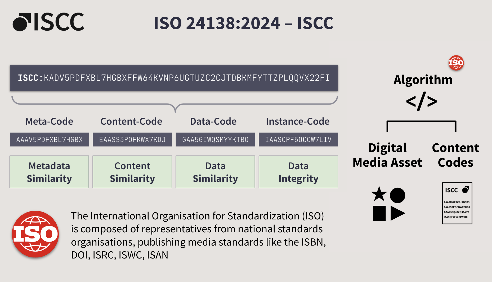

---
layout:
  title:
    visible: true
  description:
    visible: false
  tableOfContents:
    visible: true
  outline:
    visible: true
  pagination:
    visible: true
---

# ISCC Content Fingerprinting

Liccium is based on the International Standard Content Code (ISCC) and is one of the first applications of its kind. The ISCC is a new and highly innovative open identification system and global ISO standard (ISO 24138:2024) that enables decentralised digital content identification. Thanks to the ISCC, any creator, platform or other user with access to digital media content can derive the identifier from the digital media assets, such as images, videos, audio or text files.

The fact that the ISCC is generated directly from the digital media file eliminates the need for manual application and management of the identifier, as is necessary with ISBN, ISRC, DOI, and other legacy identifier standards. Each digital media file has its own unique identifier, which does not need to be applied but is extracted from the content. This means that two users or machines can generate the same or a similar identifier directly from the media file without exchanging any kind of information or metadata about the content.&#x20;

<figure><figcaption>
ISCC Foundation: <a href="https://iscc.io">iscc.io</a>
</figcaption></figure>

### A content-derived identifier with near duplicate matching capabilities

ISCC is a short, multi-composite identifier that combines cryptographic hashes, which make it possible to verify content integrity and determine whether the file has been modified, with similarity-preserving hashes in the other code units. In cases where there are different versions of the same content or content in different file formats, slightly modified or manipulated content, or content from which the metadata has been removed, the identifiers derived from the content are different but likely to match up to a certain degree of modification. Thus, ISCC supports the efficient detection of near-duplicate content while ensuring the integrity of the content. Already today, ISCC codes can be generated from most file formats of all media types (text, images, video, audio), which means that the same identification system can be used by all media sectors. And within a sector, the ISCC can be used for all content types, e.g. a news publisher could use it for press photos, news articles, videos, or podcasts.

The key properties of ISCC fingerprinting:

* **Integrity Verification:**\
  Cryptographic hashes detect even minor alterations, ensuring content integrity.
* **Similarity Matching:**\
  Similarity-preserving hashes (SimHashes) identify near-duplicate files, enabling tracking across content transformations.
* **Universal Application:**\
  ISCC facilitates consistent metadata management, rights tracking, and reliable content authentication, serving as a universal reference point for digital media, fostering interoperability and persistent linking of claims and content across creative industries.


 In 2024, ISO published the International Standard Content Code (ISCC) as international standard for digital content identification, ISO 24138:2024: [https://www.iso.org/standard/77899.html](https://www.iso.org/standard/77899.html)


For more information on ISCC, see [https://iscc.io](https://iscc.io)


