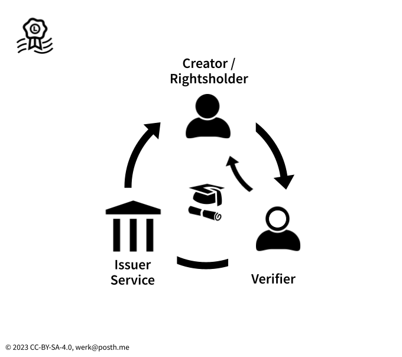

# Issuers, holders, and verifiers

<figure><figcaption>
Verifiable credentials VCs in the media industries
</figcaption></figure>

In the context of the cultural and creative industries, any organisation, institution, or trusted service could potentially be an issuer of verifiable credentials and act as certification authority for attribution or assertions. Let’s have a look at a few examples:

* A membership organisation could issue VCs to their members;
* A CMO could issue VCs to creators they represent;
* A publisher or media organisation could attest attribution of authors, photographers, and freelancers;
* Any publicly known entity could issue VCs based on qualified certificates that were already issued to them.

Verifiable credentials have the potential to provide sufficient identification about the holders as the parties making content declarations, such as:

* Creators, i.e., writers, bloggers, photographers, journalists, musicians, etc.;
* Rightsholders, i.e., publishers, labels, intermediaries, retailers.

The verifier of a VC could be:

* Any user who wishes to authenticate the content declaration;
* A platform, such as an Online Content-Sharing Service Provider (OCSSP);
* Retailers and shops that require domain-specific identity confirmation or want to verify claims to content or attribution.
